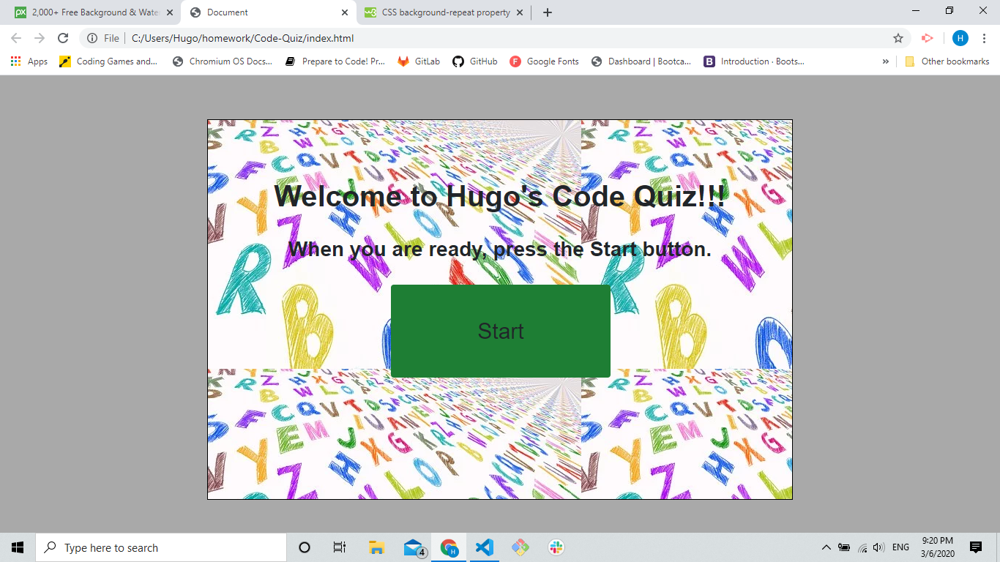
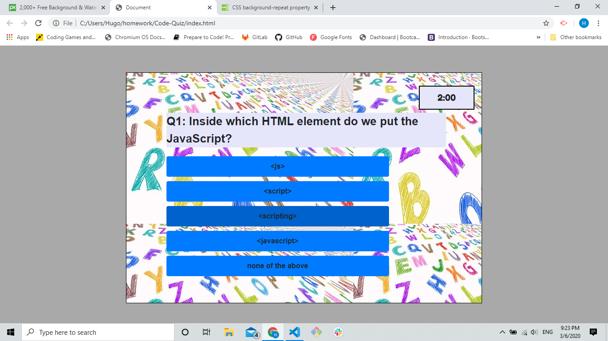
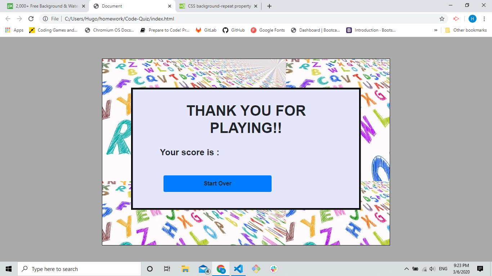
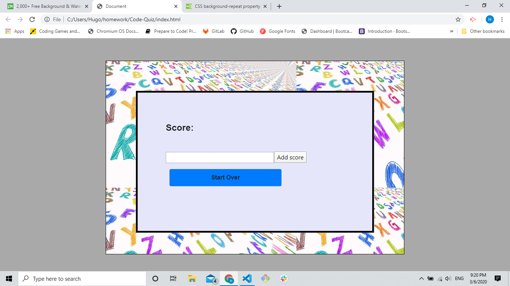

# Welcome to Hugo's quiz

## Introduction

Alright! So... this is a simple quiz game that I created as part of Homework for the bootcamp I am attending. It was a fun project, very hard and frustrating, but fun to see it all come together. I hope  you, the User, will have fun playing it!!

## Instruction

1. On the first page, you will receive a welcome page with a Start Button. Once, you click to start the quiz you you receive a 5 seconds countdown before the quiz starts. 
 

 

2. Once the countdown is finished, the user will be presented with a question and a button for every answer. If the user clicks on the right question, the score will go up by 10 points, and the next question will display. if He or She clicks on the wrong answer, the time will be decreased by 15 seconds, a wrong message will display on the bottom of the screen, and a new question will be displayed.
 

 

3. If the time runs out before the end of the quiz, a Game Over screen will be displayed.
 

 

4. If the user is able to go through all the questions before time runs out, they will get a score screen where they can save their initials and score.

 

## Conclusion

This was a fun project to work on and I had the oportunity to learn many different things. I hope whoever gets to play can enjoy it and have some fun along the way. Looking forward to getting better at this...

